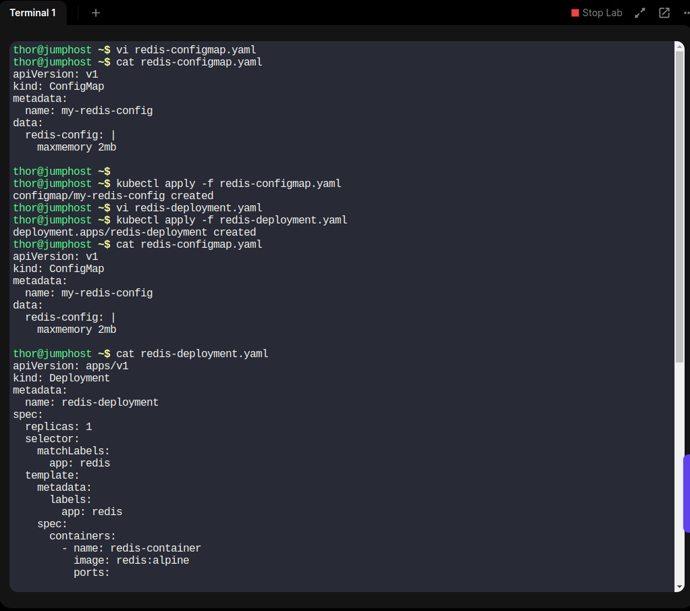

# Deploy-Redis-Deployment-on-Kubernetes
### 1. Crée le ConfigMap

1. Crée un fichier YAML nommé `redis-configmap.yaml`

2. Applique ce ConfigMap à ton cluster en exécutant la commande :

    ```bash
    kubectl apply -f redis-configmap.yaml
    ```

### 2. Crée le Déploiement

1. Crée un fichier YAML nommé `redis-deployment.yaml` 

2. Applique ce déploiement à ton cluster en exécutant la commande :

    ```bash
    kubectl apply -f redis-deployment.yaml
    ```


### 3. Vérifie le Déploiement

1. Vérifie que le déploiement est en cours d'exécution avec :

    ```bash
    kubectl get deployments
    ```

2. Vérifie que le pod est bien créé et en état de fonctionnement :

    ```bash
    kubectl get pods
    ```


